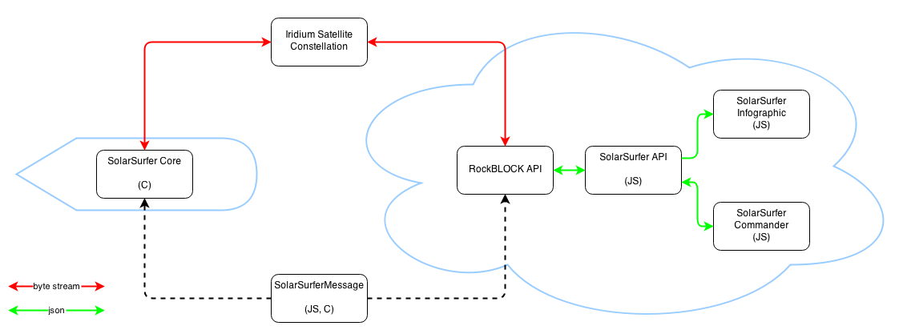

# SolarSurfer

Robotic solar powered surfboard propelled by the BlueRobotics T100 Thruster.

## Overview

The SolarSurfer is robotic surfboard propelled by two T100s. It will be launched from the coast of California on a 2,500 mile journey to Hawaii. It will complete the three-month trip completely autonomously.

Cause why not.

## Hardware

The following hardware is used:

* Invensense MPU-6000 for compass tilt compensation
* UBlox GPS using binary communication
* HMC5883 compass
* [BLDC Monitor](https://github.com/rjehangir/bldc_monitor)
* TTL Serial camera
* [Rock Seven RockBLOCK](http://rockblock.rock7mobile.com/) for satellite communications
* Atlas Scientific pH sensor
* Water temperature sensor w/ one-wire interface
* Airmar WS-100WX wind/temperature/pressure sensor

## Infrastructure

The complete SolarSurfer system has many moving parts. These include:

* SolarSurferMessage - a custom message format and encoding/decoding library for JavaScript and C
* SolarSurferCore - the embedded software running on the SolarSurfer; requires SolarSurferMessage
* SolarSurferAPI - an API that sends, receives, and stores SolarSurfer messages; requires SolarSurferMessage for automated encoding and decoding
* SolarSurferCommander - a private app to review telemetry and build command messages
* SolarSurferCommander - a public app to view telemetry in an engaging format

## Test History

### 2014/08/08 - Malibu Test

* First test in open ocean
* Testing autonomous control via SolarSurferCore
* Testing end-to-end telemetry with SolarSurferCore, SolarSurferAPI, and SolarSurferCommander

### 2014/07/17 - Marina del Rey Test 2

* Testing autonomous control via SolarSurferCore
* Complete two successful figure eights!

### 2014/06/28 - Marina del Rey Test 1

* First integrated test in a large body of water
* Manual control w/ Aurora 9 TX

### 2014/06/23 - Pool Test

* Tested thrusters mounted on surf board for the first time
* Manual control w/ Aurora 9 TX
